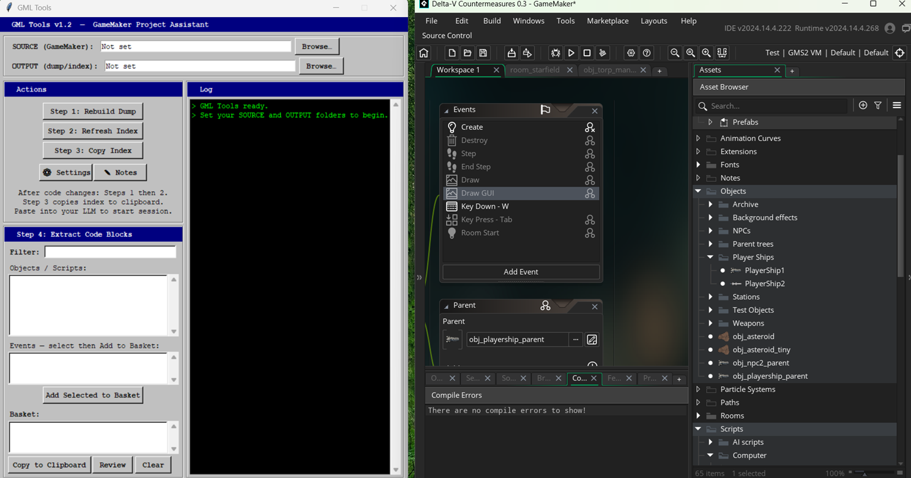
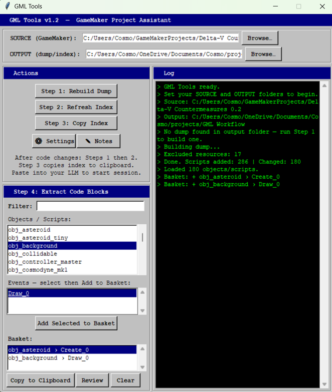
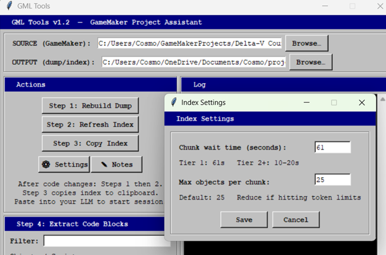
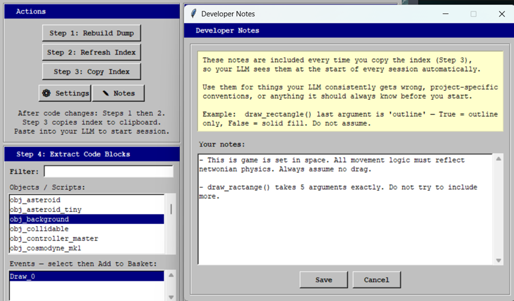

# GML Tools



This is a lightweight, 'human-in-the-loop' RAG workflow designed to make AI collaboration cheaper and easier for amateur or cash-strapped GameMaker devs.  

It is a spiritual, and for that matter *actual*, successor to 'gml-code-dump' (my first Python script and GitHub repo!). The three original scripts now combined into one and wrapped in a pleasantly aesthetic windows-95-chic UI. Also with a couple of helpful new features.


## Explanation

I’ve recently decided to stop (or significantly reduce) using agentic AI tools for my GameMaker projects because it was becoming too easy to hand over full control and lose touch with my own game. I am, however, still open to using free browser-based chatbots (e.g. ChatGPT, Claude Chat, Copilot Chat). They are extrememly frustrating and slow to use for coding projects but at least the constant back‑and‑forth keeps me grounded and learning. I've come to realise that being the human “bottleneck” is the solution and not the problem, so I’m returning to simpler tools and keeping myself in the loop.


---

## What it does



This tool is designed to make it easier and more efficient to collaborate on GameMaker projects with free online chatbots (e.g. ChatGPT, Claude chat, Copilot chat). At its heart, this a rudimentary RAG (Retrieval-Augmented Generation) workflow which keeps the user deliberately front-and-centre.

A python script reads all the code from your game, cleans and deposits it into a single .txt file, and then makes an API call to Claude Haiku (Anthropic API key not included) to generate a summarised index of every object/script, its role, and dependencies. With the click of a button, the index can quickly be shared with your LLM of choice at the start of each new conversation, to act as the authoritative source of context for the rest of the session. 

Your LLM can then request to see the full code of whichever objects/scripts/events is most relevant to the task at hand. You simply select the object or script from the list in the UI, add the codeblocks it requested to your "basket", and then click "copy to clipboard" to share it with your AI collaborator. 

This saves you time when starting new conversations, helps the chatbot to understand the broader impacts of code changes, and prevents early context bloat. 

You can also add some persistent "notes" (specific rules or instructions that you want to apply to every conversation) which will be added to the index automatically when you copy it to clipboard. 

Additionally, there is an inbuilt "review" button which you can use to get immediate, general feedback and optimisation tips on all the code currently selected in your basket. This uses the most advanced commercailly-avaialble Anthorpic model (Opus), so you can then pass the suggestions on directly to your free LLM to action. 

Note that generating or updating the index, or using the "review" button, will incur a very small API cost.

The workflow has four steps:

1. **Build / Rebuild Dump** — scans your GameMaker project and compiles every object and script into a single clean text file (`game_dump.txt`). On subsequent runs it detects what has changed and flags only those entries.
2. **Create / Refresh Index** — sends changed entries to the Claude API (Haiku by default) and generates a concise summary of each object/script, including dependencies. Appends new summaries to `game_index.txt`, replacing any outdated entries.
3. **Copy Index** — copies the full index to clipboard with a preamble that tells your LLM what it's looking at, how to request specific code blocks, and any specific instructions that you want to include at the start of any conversation.
4. **Extract Code** — filter and browse your objects/scripts, select the events you want, and copy them to clipboard in one click. A **Review** button sends your selection to Claude Opus for a quick code review streamed directly into the app.

---

## Why a separate output folder?

GML Tools writes two files — `game_dump.txt` and `game_index.txt` — to a separate output folder that you choose, rather than directly into your GameMaker project folder. This is intentional.

GameMaker's **Save As** function only copies the files it knows about. If the dump and index lived inside your project folder, a Save As would leave them behind, and your new project copy would have no index (meaning the app will try to create a brand new one from scratch, which takes ages). By keeping them in a separate folder, they survive any GameMaker file operations completely untouched.


**After a Save As:** simply click **Browse…** next to SOURCE in the app and point it at your new project folder. Your output folder — and everything in it — stays exactly where it was. If you want a fresh index for the new project version, run Steps 1 and 2. If the code hasn't changed much, the diff detection will only re-summarise what's actually different, so it won't take long.

---

## Dependencies

- Python 3.7 or higher
- An Anthropic API key — get one at https://platform.claude.com/
- Required Python packages:

```
pip install anthropic pyperclip
```

---

## Setup

**Step 1 — Install dependencies**

If you haven't already, open Command Prompt or Powershell and type:

```
pip install anthropic pyperclip
```

**Step 2 — Set your API key**

Add your Anthropic API key as an environment variable. On Windows: search *Edit the system environment variables* in the taskbar → *Environment Variables* → *New* under User variables → name it `ANTHROPIC_API_KEY`, value is your full key.

**Step 3 — Place the files**

Save `gml_tools.py` somewhere permanent — a dedicated tools folder works well. They don't need to live inside your GameMaker project.

**Step 4 — Launch the app**

Double-click `gml_tools.py`. A console window will appear and run in the background (you can ignore it). If you'd rather run it manually:

```
pythonw gml_tools.py
```

---

## Using the app

### First-time setup

1. Click **Browse…** next to *SOURCE* and select your GameMaker project folder (the one containing your `.yyp` file)
2. Click **Browse…** next to *OUTPUT* and select or create a folder where the dump and index files will live — this can be anywhere, name it whatever you like
3. Both paths are saved automatically and will reload next time you open the app

### Building the index (first time)



> ⚠️ **The first index build can take a long time** — can be up to 30 minutes depending on the size of your project. This is because every object and script needs to be summarised from scratch, and the API processes them in chunks with a mandatory pause between each to respect rate limits (I reccomend starting with a 61 second pause between chunks if you're on the beginner tier). Go make a cup of tea. **Subsequent refreshes are much faster** — the diff detection means only objects and scripts that have actually changed since the last run will be re-summarised. For most sessions this will be a handful of entries at most.

1. Click **Step 1: Rebuild Dump** — this scans your project and writes `game_dump.txt` to your output folder. Takes a few seconds.
2. Click **Step 2: Refresh Index** — this sends your code to the Claude API and writes `game_index.txt`. Watch the log panel on the right for progress.
3. If you are on a higher API tier, you can reduce the wait time between chunks in **⚙ Settings** to speed things up considerably.

### After making changes to your code (at the end of a session, or as often as you like)

Run **Step 1** then **Step 2** again. Only changed objects/scripts will be re-summarised — subsequent refreshes are much faster.

### Developer Notes



Click **✎ Notes** to open the Developer Notes editor. Anything saved here is automatically included every time you copy the index (Step 3), so your LLM sees it at the start of every session without you having to remember to paste it separately.

This is the place for things your LLM consistently gets wrong, project-specific conventions, or anything it should always know before you start. For example:

- *`draw_rectangle()` last argument is 'outline' — True = outline only, False = solid fill*
- *All NPC objects inherit from `obj_npc_parent` — always check the parent before assuming a variable isn't set*
- *`global.universe_x` and `global.universe_y` are the camera origin, not the player position*

Notes are saved automatically to `gml_tools_config.json`.

### Starting an AI session

1. Click **Step 3: Copy Index** — this copies your index to clipboard with a preamble explaining the format to your LLM, plus any Developer Notes you have saved
2. Paste into your LLM of choice at the start of a new conversation
3. Describe what you want to work on — the LLM will review the index and tell you which objects/scripts it needs to see in full, using the format `obj_name:Event_0`

### Extracting code

1. Type in the **Filter** box to narrow the list — it updates live as you type
2. Click an object or script to see its events
3. Select one or more events (Ctrl+click for multiple) and click **Add Selected to Basket** — scripts have no events and go straight to the basket
4. Repeat for any other objects/scripts the LLM requested
5. Click **Copy to Clipboard** and paste into your LLM conversation
6. Work on the code, paste the result back into GameMaker

### Reviewing code with Opus

With items in your basket, click **Review** — the selected code is sent to Claude Opus with a prompt asking for bugs, optimisations, and anything risky. The response streams live into the log panel.

### Index Settings

Click **⚙ Settings** to adjust:

| Setting | Default | Notes |
|---|---|---|
| Chunk wait time | 61 seconds | Tier 1 API accounts need ~61s between chunks. Tier 2+ can use 10–20s. |
| Max objects per chunk | 25 | Reduce if you hit token limit errors during indexing. |

Settings are saved automatically.

### What to do after GameMaker Save As

Point the SOURCE folder at your new project location — click **Browse…** next to SOURCE and select the new folder. Your output folder is unaffected. Run Steps 1 and 2 to refresh; the diff detection will only re-summarise what has actually changed.

---

## File reference

| File | Purpose |
|---|---|
| `gml_tools.py` | Main application |
| `gml_tools_config.json` | Auto-generated — saves your folder paths, settings, and developer notes |
| `game_dump.txt` | Auto-generated — full cleaned code dump (in your output folder) |
| `game_index.txt` | Auto-generated — AI-generated index (in your output folder) |

---

## Notes and limitations

- Currently configured for **Anthropic Claude** (Haiku for indexing, Opus for review). Support for alternative models and providers is on the roadmap.
- The diff detection compares full event bodies — if only a comment changes, that object will be re-indexed. This is intentional.
- `game_dump.txt` and `game_index.txt` are plain text — you can open and read them at any time.
- `gml_tools_config.json` contains your local folder paths — add it to your `.gitignore` if you push this folder to a repo.

---

*Built as part of a personal AI learning project. Feedback and contributions welcome.*
